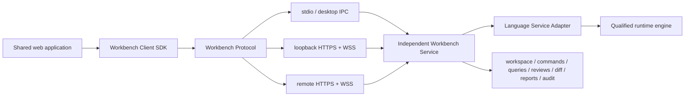

# ADR-003: Client, Service, and Deployment Architecture

- Status: proposed for revised Gate P0
- Date: 2026-07-24

## Decision

Build one transport-neutral client/service product:

- one shared web application;
- one product-owned Workbench Client SDK;
- one versioned Workbench Protocol;
- one independently executable Workbench Service;
- transport bindings for stdio/desktop IPC and authenticated HTTPS/WebSocket;
- deployment hosts that package these same contracts rather than fork semantics.

Tauri is an optional packaging and OS-integration host for the fully offline desktop profile. It is not the application architecture, service boundary, semantic center, or only production route.

## Boundary

The browser and desktop render the same view, command, diagnostic, identity, review, and report DTOs. Semantic logic lives in the service or product-owned pure packages used by it, never in a Tauri command handler or React component.

## Deployment profiles

1. **Public web evaluation** — packaged sample workspaces, read-only/restricted capability set, no arbitrary local filesystem access.
2. **Browser + local companion** — first-class production authoring: shared web UI connects to a loopback-only Workbench Service after explicit pairing.
3. **Tauri desktop** — same UI and service, packaged for fully offline use with scoped OS integration.
4. **Managed hosted** — future authenticated multi-tenant or dedicated service using the same protocol with repository/object/database adapters.

The browser profile is not demoted to “demo architecture.” It supports practical review, navigation, reports, comments, baseline comparison, and dispositions. Local installation is required only for authoritative access to arbitrary local folders, local Git/engines, offline report toolchains, or other OS capabilities.

## Consequences

Positive:

- engine, shell, and deployment choices can evolve independently;
- browser access serves non-modelers without desktop installation;
- desktop remains fully offline and least-privilege;
- hosted collaboration can be added without rewriting semantic contracts;
- service and protocol tests run headlessly.

Costs:

- protocol evolution, authentication, cancellation, streaming, and reconnect semantics become product responsibilities;
- browser/local-companion pairing creates a real security boundary;
- all UI work must tolerate negotiated capabilities and partial service availability.

## Rejected

- Tauri-centric application service exposed directly to React;
- browser-only authoritative state;
- separate desktop and hosted semantic implementations;
- engine-native ASTs over IPC;
- GitHub Pages as the production authority surface;
- arbitrary local daemon HTTP access without pairing/origin controls.

## Acceptance

- the same built UI passes contract tests against an in-process test service, stdio service, loopback service, and remote test service;
- changing transport does not change semantic DTOs or command receipts;
- the Workbench Service runs without Tauri;
- capability negotiation disables unsupported UI actions;
- desktop has no required network dependency after installation;
- non-modelers can complete the defined browser review tasks;
- local companion rejects non-loopback binding, unpaired clients, disallowed origins, expired tokens, and unauthorized workspace paths.
