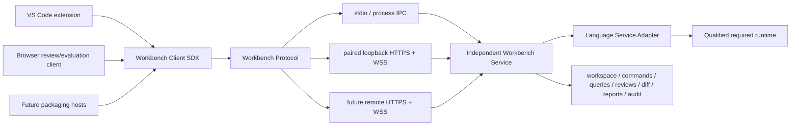

# ADR-003: Client, Service, and Deployment Architecture

- Status: service boundary accepted; deployment-profile claims amended for
  recovery
- Original date: 2026-07-24
- Recovery amendment: 2026-07-25

## Context

The workbench requires one semantic, command, identity, assurance, and evidence
core that can support local authoring, bounded browser review, automated
qualification, and future deployment hosts. A client or packaging choice must
not become a second semantic implementation.

P4 and P5 invalidation showed that the earlier decision overcommitted to a
shared web shell as the primary authoring product before that shell passed
source, notation, and practitioner gates. The transport-neutral service
boundary remains useful; the primary authoring-host decision changes.

## Decision

Build one transport-neutral client/service product:

- one product-owned Workbench Client SDK;
- one versioned Workbench Protocol;
- one independently executable Workbench Service;
- transport bindings for stdio/process IPC and authenticated loopback or remote
  HTTPS/WebSocket;
- bounded clients that consume the same DTOs and commands;
- deployment hosts that package these contracts rather than fork semantics.

The recovery authoring client is a **VS Code extension** that uses native VS
Code source, Explorer, Search, Problems, SCM/diff, command, settings, progress,
and workspace-trust capabilities. Webviews are limited to notation-specific and
assurance surfaces.

The browser shell remains a bounded recovery/evaluation and future scoped-review
client. It is not a production-authoring profile until it independently passes
exact-artifact and practitioner gates.

Tauri remains an optional future packaging and OS-integration host. It is not
the application architecture, service boundary, semantic centre, or only
production route.

## Boundary

Clients render the same view, command, diagnostic, identity, review, and report
DTOs. Semantic logic lives in the service or product-owned pure packages used
by it, never in a VS Code webview, React component, Tauri command handler, or
browser store.

## Deployment profiles

1. **VS Code local authoring — recovery target**
   - arbitrary authorized local workspaces;
   - native text editing and language integration;
   - optional local Git capability;
   - notation and assurance webviews backed by the service;
   - exact packaged VSIX qualification.
2. **Public web evaluation**
   - packaged sample workspaces and bounded workflows;
   - no arbitrary local filesystem authority;
   - no production-authoring claim.
3. **Browser plus local companion — recovery evaluation only**
   - explicit loopback pairing and capability handles;
   - source and engines remain local;
   - authoring remains disabled until the profile passes independent recovery
     gates.
4. **Tauri desktop — deferred**
   - same UI/service contracts in a future offline package;
   - no semantic logic in host commands.
5. **Managed hosted — future**
   - authenticated single-tenant, dedicated, or multi-tenant service;
   - repository/object/database adapters behind the same protocol.

## Consequences

Positive:

- the reusable service and protocol work is preserved;
- source authoring uses an existing IDE instead of recreating one;
- browser access can serve non-modelers without defining authority;
- deployment choices can evolve without rewriting semantic contracts;
- service and protocol tests remain headless and deterministic;
- notation views can be qualified independently of the text editor.

Costs:

- the VS Code extension becomes a supported client with packaging and Extension
  Host qualification responsibilities;
- protocol evolution, authentication, cancellation, streaming, and reconnect
  semantics remain product responsibilities;
- webviews must integrate selection, source reveal, theme, accessibility, and
  lifecycle without duplicating IDE features;
- each claimed deployment profile requires its own exact-artifact evidence.

## Rejected

- a monolithic web application recreating a general-purpose IDE;
- a Tauri-centric application service exposed directly to React;
- browser-only authoritative state;
- separate desktop, extension, and hosted semantic implementations;
- engine-native AST or EMF objects over the product protocol;
- GitHub Pages as a production authority surface;
- arbitrary local daemon access without pairing and origin controls;
- a VS Code webview that recreates Explorer, editor, Search, Problems, SCM,
  settings, or workspace trust.

## Acceptance

The amended architecture passes only when:

- the Workbench Service runs without any client host;
- changing transport does not change semantic DTOs or command receipts;
- the packaged VSIX opens the recovery pilot in a clean profile;
- the required runtime supports semantic open without optional Spec42;
- capability negotiation disables unavailable actions;
- a non-Git workspace retains source, interface, verification, and notation
  capabilities;
- notation webviews contain no source-writing or semantic authority;
- the browser companion rejects non-loopback binding, unpaired clients,
  disallowed origins, expired credentials, and unauthorized workspace paths;
- no deployment profile receives a product claim before its exact-artifact and
  practitioner gates pass.

## Migration

1. Keep the existing service, protocol, Client SDK, security controls, and
   source-command boundary.
2. Correct active gate and release claims through Recovery Gate R0.
3. Build the bounded recovery pilot and reference answers.
4. Qualify one required runtime profile.
5. Deliver the VS Code text-authoring slice.
6. Add `InterconnectionProjection` and the notation renderer.
7. Add three source-preserving graphical operations.
8. Run interface assurance and independent practitioner gates.
9. Reconsider browser or Tauri production profiles only after R6 passes.

Active progression is governed by
`docs/revamp/37-recovery-acceptance-contract.md`.
