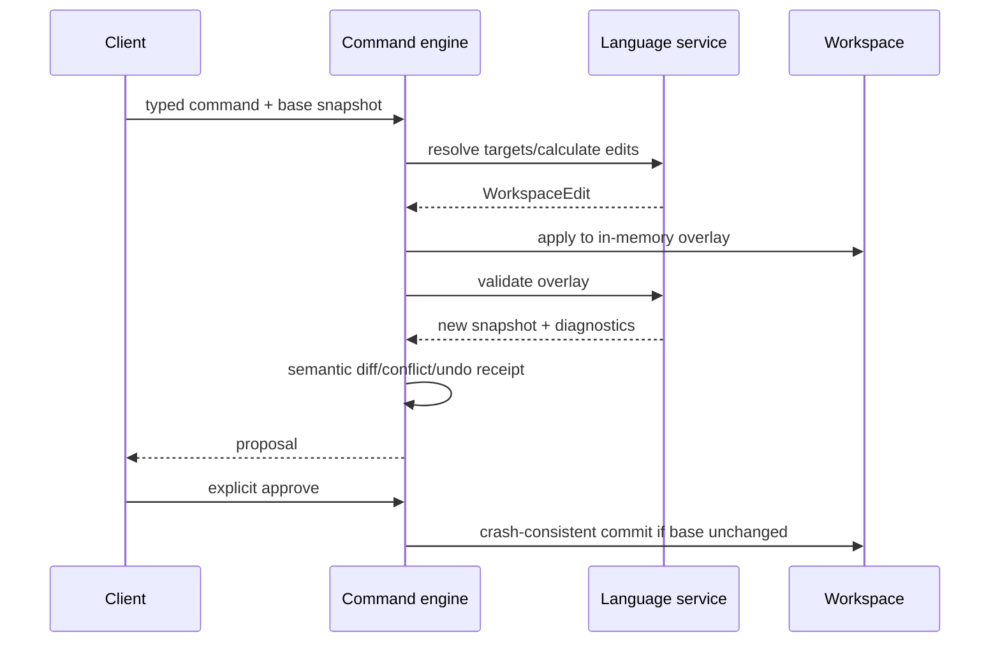

# ADR-004: Source-Edit Command Model

- Status: accepted at Gate P0
- Date: 2026-07-24

## Decision

All non-text mutations use typed commands executed as validated transactions. UI components and AI never write source strings directly.

## Transaction



Every result includes proposed edits, affected durable ids, diagnostics before/after, semantic diff, conflicts, undo information, engine/profile metadata, and approval state.

## Minimum command set

Create package/definition/usage/port/connection/interface/flow/requirement/satisfy/verify/action/state; delete; rename; move; change type/multiplicity; set value/property; update documentation; apply versioned modeling pattern.

## Conflict and safety rules

- base snapshot/source hashes are mandatory;
- edits apply to an overlay first;
- authoritative diagnostics run before apply;
- commands touching opaque/unsupported/recovered ranges fail closed;
- unvalidated warnings/errors follow versioned policy; no UI-specific exception;
- each file replacement is atomic; multi-file commands use a durable journal and recovery protocol to provide logical all-or-nothing completion;
- undo uses inverse edit/receipt against compatible state;
- an incompletely committed multi-file transaction blocks normal workspace open until recovery completes or reports a manual conflict.

## Commit and recovery state machine

```text
PROPOSED
  -> PREPARED       all base hashes verified; overlays validated
  -> COMMITTING     journal + original hashes/backups fsynced
  -> COMMITTED      per-file temp write/fsync/atomic rename complete; directory metadata flushed where supported
  -> FINALIZED      new snapshot verified; journal retained as command audit/history

PREPARED/COMMITTING -> ROLLED_BACK
COMMITTING with external divergence -> RECOVERY_CONFLICT
```

- The application service holds the workspace write lease for commit.
- External-writer changes before `COMMITTING` cause a stale-base rejection.
- Each destination is rechecked immediately before replacement.
- Startup scans durable journals before indexing. It completes a provably safe commit, restores verified backups, or blocks with a recovery packet; it never guesses.
- Finalized and rolled-back journals are immutable history. Startup recovery
  acts only on incomplete transactions; later valid commands may supersede the
  file hashes recorded by older finalized journals.
- Backups/journals contain project-relative paths and content hashes. Model content retention follows the configured audit/backup policy.
- Undo is a new transaction against the committed snapshot, not an unguarded file restore.
- Fault-injection tests interrupt before/after every journal, write, fsync, rename, verification, and cleanup boundary on every target OS.

## Text editing

Direct Monaco typing remains permitted as source authoring. It creates document versions and diagnostics, not a command receipt for every keystroke. Refactors/quick fixes use language-service edits and the same validation/apply transaction.

## AI

AI calls `propose_commands` and `validate_commands`. Only an explicit user approval can call `apply_approved_commands`. Raw repository write and whole-document replacement are absent.

## Rejected

- regex/template edits in components/store;
- diagram-specific source synthesis;
- auto-applying “safe” Draw.io changes;
- whole-document AI replacement;
- command success based only on parse acceptance.

## Acceptance

- golden source edits/diffs;
- conflict and stale-base tests;
- crash/restart recovery and external-writer race tests;
- comment/unknown syntax preservation;
- multi-file atomicity;
- rename/move identity behavior;
- undo/redo property tests;
- deterministic before/after diagnostics;
- audit record for every applied non-text command.
