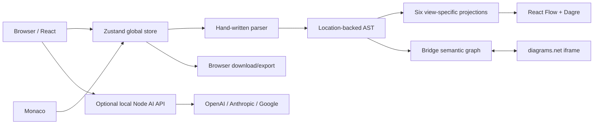
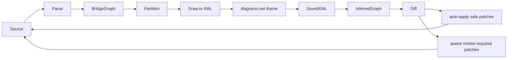

# Current-State Audit

Status: Phase 0 evidence baseline
Observed: 2026-07-24
Repository: `haitaowu12/sysmlv2_viewer`
Baseline: `638e5aa1cc63ddb3a1c770f36432d6acedfbc541` (`origin/main`), committed 2026-06-09, `Merge Webel Cameo pilot MoC parser fixtures`
Audit scope: code at the baseline above, not README claims and not later local branches

## Executive finding

The baseline is a capable single-document browser viewer/editor for a deliberately limited language subset. It is not a workspace, language-service, repository, or engineering-assurance architecture.

The most consequential correction to the expected current-state assumptions is that Peggy is not the parser authority. `src/parser/parser.ts` is a 2,366-line hand-written lexer and recursive-descent parser. `peggy` is installed but has no imports in tracked source.

Current native views and the Draw.io bridge build separate semantic interpretations from the same shallow AST. Source is intended to be canonical, but several mutation paths synthesize source with templates, regular expressions, or whole-document replacement. No stable cross-file identity, authoritative workspace semantics, model query service, command transaction, review store, report engine, or Git-aware semantic diff exists.

## Repository tree

The baseline has 104 tracked files and one Vite application:

```text
.github/workflows/deploy.yml
docs/
  developer-guide.md
  r2-product-contract.md
  sysml-v2-release-baseline.md
  user-guide.md
  webel-cameo-pilot-coverage.md
server/
  ai-service.js
  ai-service.test.js
  drawio-utils.js
  extract_docs.py
  index.mjs
  routes.js
  vite-plugin.js
src/
  App.tsx
  bridge/                 # Draw.io and bridge semantic conversion
  components/             # Monaco, diagrams, panels, editing controls
  examples/               # three bundled single-file examples
  hooks/
  parser/                 # hand-written parser, types, serializer
  store/store.ts          # global Zustand state and source mutations
  test/                   # Vitest unit/component tests
  types/
  utils/
  views/                  # six AST-driven native view implementations
package.json
vite.config.ts
vitest.config.ts
```

Large responsibility concentrations:

| File | Lines | Current responsibility |
|---|---:|---|
| `src/parser/parser.ts` | 2,366 | tokenization, parsing, recovery, diagnostics |
| `src/store/store.ts` | 1,164 | model state, synchronization, source editing, file I/O coordination |
| `src/bridge/semantic-to-sysml-patch.ts` | 966 | Draw.io-derived patch synthesis |
| `src/bridge/sysml-to-semantic.ts` | 738 | shallow AST to bridge graph |
| `src/components/PropertyPanel.tsx` | 694 | schema heuristics and direct source edits |
| `src/App.tsx` | 616 | application shell, panels, seven fixed tabs |

## Runtime architecture



There is no application-service boundary. React components and the Zustand store own parsing, projections, synchronization, and source mutation.

## Parser architecture

- `src/parser/parser.ts` implements a custom tokenizer and recursive-descent parser.
- `src/parser/types.ts` defines a shallow AST with source locations.
- The parser recognizes a useful subset of packages, parts, ports, connections, requirements, relationships, actions, states, viewpoints, and related forms.
- Unknown syntax recovery creates `Unknown` nodes and warnings. Comments are generally skipped except modeled documentation.
- `src/parser/serializer.ts` cannot guarantee lossless preservation; unsupported nodes may be serialized as comments.
- No authoritative namespace graph, standard-library environment, full KerML semantics, cross-file linker, type system, or compiler-grade edit service exists.
- `peggy@5.0.6` is an unused direct dependency.

Conclusion: the parser may support temporary legacy import/projection comparison. It is not fit as the target language authority.

## Semantic model representation

Two competing representations exist:

1. Parser AST used directly by native views and property/source operations.
2. `bridge-v1` semantic graph used for Draw.io synchronization and some exports.

Bridge identity is based on an FNV-1a hash of a generated path shaped like `root/<kind>:<name>#<occurrence>`. Native node identity includes kind, name, line, and column. Both change under ordinary edits, rename, movement, or sibling reordering.

Reference normalization collapses qualified names to the final token in important bridge paths. Unresolved relationships may be omitted rather than retained as explicit unresolved semantic facts. This is unsuitable for assurance or traceability.

## Source-editing paths

| Initiator | Path | Validation | Finding |
|---|---|---|---|
| Monaco typing | source string → 500 ms parse | local parser markers | canonical intent; single document only |
| Native connect | view → store template insertion | parse; warnings may not block | diagram writes source indirectly but without a typed command |
| Property edit | panel → regex/string splice | local parse | schema and edit logic live in UI/store |
| Delete/create | source offsets/templates | local parse | no transaction, semantic preview, or conflict model |
| Draw.io | XML → inferred bridge graph → patch queue | bridge diff and local parser | bidirectional semantic interpretation; unsafe as authority |
| AI | provider returns whole `sysml` string → store replacement | non-empty/braces plus local parse | no model citations, command validation, approval transaction, or audit |

No path returns diagnostics-before/after, semantic diff, affected stable identities, conflicts, and undo as one transaction.

## Diagram generation

Native views are hard-coded AST projections:

- General
- Interconnection
- Requirements
- Action Flow
- State Transition
- Viewpoints

Each view independently reconstructs nodes and edges. React Flow and Dagre provide rendering and automatic layout. Layout is component-local and not persisted as a versioned saved view. The application exposes seven fixed tabs, including Draw.io, as its primary information architecture.

Observed screenshots:

- `output/playwright/phase0-current-general.png`
- `output/playwright/phase0-current-interconnection.png`
- `output/playwright/phase0-current-source-navigation.png`
- `output/playwright/phase0-current-drawio.png`
- `output/playwright/phase0-current-ai-panel.png`

The general view becomes unreadably small at fit-to-screen for the bundled rover example. Source-to-visual selection works for basic cases. There is no matrix, query-defined projection, review overlay, or baseline comparison.

## Draw.io synchronization

Current flow:



The embed is hosted at `https://embed.diagrams.net`. During the baseline capture the browser reported a 404 for the embed notification endpoint. Arbitrary Draw.io labels/styles can be interpreted back into model semantics. `applyAllPatches` can force queued patches through. This creates preservation, identity, and authority risks.

Decision input: retain presentation export/markup capability only. Remove bidirectional semantic editing unless a later owner decision explicitly reverses the migration plan and a preservation proof exists.

## AI path

- The browser sends source text, Draw.io XML, attachments, and conversation context to a local Node endpoint.
- The server reads provider credentials from environment variables and supports OpenAI, Anthropic, and Google.
- Provider responses are expected to include a whole SysML document.
- Client validation checks basic shape and local parse results, then replaces canonical source.
- A local heuristic mode also generates/modifies source.

Positive: provider keys are not embedded in the browser bundle.
Blocking gap: the path is not proposal-only, does not expose narrow grounded tools, does not require cited model identities, and has no deterministic command-validation or audit boundary.

## Persistence

- Canonical source exists in browser memory until browser download.
- One local file can be opened through a file picker or drag/drop.
- `localStorage` is used for panel widths and recent library categories only.
- No workspace configuration, source roots, library lock, saved view, layout, review, evidence, baseline, or cache format exists.
- No authoritative IndexedDB state exists, but no durable project state exists either.

## Deployment

- `vite.config.ts` uses base path `/sysmlv2_viewer/`.
- GitHub Actions builds and deploys a static Vite bundle to GitHub Pages on `main`.
- The optional AI server is available only through a local development/server process and is not part of static deployment.
- The server exposes a local HTTP API with CORS and no authentication.

GitHub Pages is suitable only for a future read-only demonstration. It cannot be the primary workbench deployment.

## Current UI workflows

1. Load one file or select one of three examples.
2. Edit text in Monaco and view parser diagnostics.
3. Switch among fixed diagram tabs.
4. Select model explorer entries and reveal source.
5. Create, connect, rename, delete, or edit a subset through UI controls.
6. Synchronize through Draw.io.
7. Export SysML, Draw.io XML, SVG, or PNG.
8. Ask the optional AI panel to generate or edit a whole model.

Missing: folder/workspace lifecycle, index progress, library configuration, multi-file search/navigation, semantic refactoring, model queries, matrices, reviews, Git baselines, deterministic reports, and evidence manifests.

## Test baseline

Commands were run from a clean linked worktree at the baseline commit.

| Command | Result | Evidence |
|---|---|---|
| `npm ci` | pass | 9 audit findings reported: 2 low, 2 moderate, 5 high across all dependencies |
| `npm run lint` | pass | exit 0 |
| `npm run test` | pass with skips | 17 files passed, 1 skipped; 148 tests passed, 19 skipped; 3.82 s |
| `npm run test:release` | command passed; corpus qualification **not run** | 2 baseline tests passed, 19 upstream tests skipped because the corpus was absent |
| `npm run build` | pass | Vite 7.3.3; main chunk 406.58 kB, 117.57 kB gzip |
| `npm audit --omit=dev` | fail | 2 moderate production vulnerabilities through `monaco-editor`/`dompurify`; fix available |

Machine-readable environment, command classification, reproduction commands, and screenshot hashes are in `phase0-baseline-evidence.json`. The upstream corpus qualification is explicitly **not run** and cannot support a conformance claim.

Test inventory:

| Area | Files/tests |
|---|---|
| parser and diagnostics | parser 32; parser errors 13; MoC constructs 8 |
| bridge | 8 |
| layout/routing/drag-drop | layout 11; edge routing 17; DnD 9 |
| store/file/property/relationship | store 10; file I/O 4; properties 8; relationship 5 |
| components/accessibility | app layout 2; library panel 6; UI accessibility 2 |
| examples/baseline | examples 6; release baseline 2 |
| AI service | 5 |
| upstream corpus | 19 skipped unless `SYSML_V2_RELEASE_DIR` is externally supplied |

No mandatory CI coverage exists for full upstream fixtures, E2E, visual regression, performance, semantic diff, Git integration, report determinism, license policy, threat boundaries, or practical keyboard/screen-reader workflows.

## Supported-language inventory

The current claims are fixture-specific, not conformance claims.

| Area | Current evidence | Classification |
|---|---|---|
| packages/import-like syntax | local parser fixtures | partial; no workspace resolution |
| parts/usages/definitions | local tests and examples | supported subset |
| ports/connections/flows/interfaces | local tests and bridge views | partial; shallow resolution |
| requirements/satisfy/verify | local tests and requirement view | partial |
| actions/states/transitions | local tests and views | partial |
| viewpoints | local view | partial |
| broader KerML, expressions, metadata, variants/configurations | recovery or isolated cases | parsed/preserved only or unsupported |
| standard library | optional external corpus references | not a mandatory resolved environment |
| multi-file imports, aliases, namespaces | no authoritative linker | unsupported |
| semantic tokens/refactors | Monaco lexical tokens/snippets only | unsupported |

Unsupported/unknown syntax is not guaranteed lossless through serializer or generated edits. The product must stop making broad support claims until `05-capability-matrix.md` gates them.

## Dependencies and licenses

The repository has no root `LICENSE` file. That is a release blocker independent of dependency licenses.

Direct runtime dependencies:

| Package | Resolved | License | Disposition |
|---|---:|---|---|
| `@dagrejs/dagre` | 2.0.4 | MIT | retain provisionally for limited auto-layout |
| `@monaco-editor/react` | 4.7.0 | MIT | retain; replace custom language authority with LSP client |
| `@xyflow/react` | 12.10.0 | MIT | retain provisionally behind diagram engine |
| `lucide-react` | 1.8.0 | ISC | retain |
| `peggy` | 5.0.6 | MIT | delete; unused |
| `react` / `react-dom` | 19.2.4 | MIT | retain |
| `zustand` | 5.0.11 | MIT | restrict to UI state; remove semantic authority |

Lockfile license count: MIT 284, ISC 24, Apache-2.0 16, BSD-2-Clause 8, BSD-3-Clause 5, MIT-0 2, Python-2.0 1, CC-BY-4.0 1, MPL-2.0-or-Apache-2.0 1, BlueOak-1.0.0 1, CC0-1.0 1. A distributable SBOM and legal review remain required.

## Retain / refactor / replace / delete / defer

| Component | Decision | Evidence and migration impact |
|---|---|---|
| Monaco wrapper | retain/refactor | strong editor base; connect to authoritative LSP |
| React and selected UI primitives | retain/refactor | reusable shell technology; current information architecture replaced |
| React Flow node components | retain provisionally | usable 2D canvas; semantic and command logic must move out |
| Dagre | defer decision | useful small-view layout; benchmark against ELK for larger projections |
| local-first/provider-secret posture | retain/harden | correct intent; add keystore, indicator, explicit egress consent |
| SVG/PNG export | retain/refactor | useful output; add deterministic manifests |
| hand-written parser | replace | inadequate workspace/KerML/conformance authority |
| AST-driven native projections | replace | duplicated semantics and hard-coded views |
| bridge semantic graph | replace | unstable identity and shallow reference resolution |
| Draw.io bidirectional editing | delete | competing authority and unsafe inferred semantics |
| Draw.io export/markup | defer/retain | owner approval; isolated, non-authoritative only |
| Zustand semantic store | replace | application service and immutable snapshots become authority |
| direct source string mutations | delete | typed command transaction replaces them |
| whole-document AI mutation | delete | proposal-only grounded tools replace it |
| GitHub Pages production target | replace | optional read-only demo only |
| existing fixtures | retain selectively | requalify syntax/license and classify by capability profile |

## Parallel work and migration risk

No open GitHub PR existed at audit time. A local branch, `codex/sysmlv2-execution-foundation`, at `c67c5a42d344d0afc40b2eb73e8d7236a39d1e68`, is 17 commits ahead of the baseline with 55 changed files, 6,343 insertions, and 352 deletions. It adds parser features, official fixture qualification, an Eclipse validator bridge, and deterministic agent tools.

That branch is not merged into this audit. Useful validation and fixture assets should be extracted only after ADR-001 qualification. Parser expansion must not become the new authority by inertia.

## Primary migration risks

1. Two semantic authorities persist during migration.
2. New engine coverage is assumed rather than differentially qualified.
3. Unknown syntax/comments are damaged by legacy edits.
4. Review identity is anchored before rename/move behavior is proven.
5. a very new pre-1.0 engine changes APIs or diagnostics.
6. Desktop IPC exposes overly broad filesystem/process access.
7. Draw.io remains a hidden semantic backdoor.
8. Existing examples encode non-current syntax.
9. optional upstream corpus continues to produce false confidence.
10. Phase scopes drift into UI feature work before language/workspace gates pass.

## Audit conclusion

Retain the editor and selected rendering/UI primitives. Replace the semantic center, workspace lifecycle, mutation model, persistence, deployment role, and AI contract. The target begins with official semantic references, comparative runtime qualification, and a workbench-owned service/protocol boundary—not with a preselected engine or new UI.
