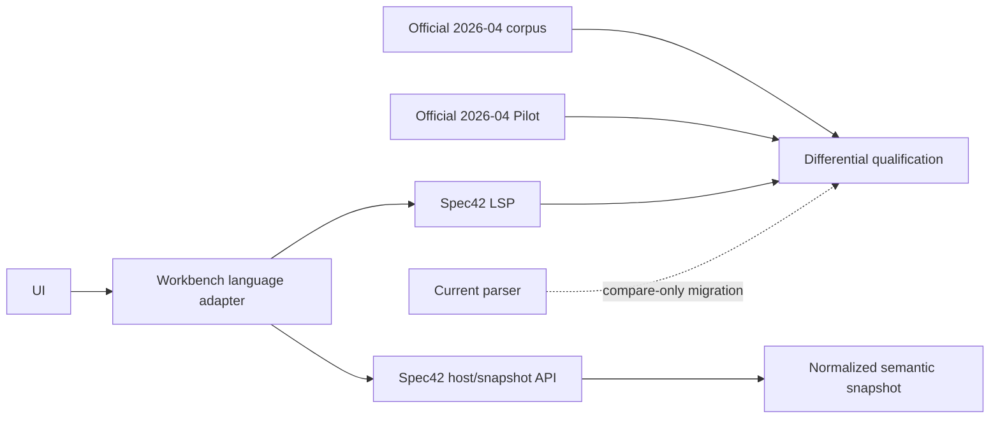

# Language Engine Options

Status: recommended by proposed ADR-001; awaiting Gate P0 owner approval and Phase 1 qualification
Language profile: SysML 2.0 / KerML 1.0, official release `2026-04`

## Recommendation

Select Option D: hybrid evidence architecture with one runtime authority.

- Interactive authority: Spec42 `v0.46.0` at commit `a3f066ee4095a0eb8b37545ffd4846d42804658a`.
- Authority boundary: workbench-owned LSP plus semantic-snapshot adapter.
- Independent oracle: official Release/Pilot `2026-04`.
- Legacy parser: compare-only/import compatibility for a bounded migration; never silent fallback.
- Engine failure behavior: explicit degraded/read-only semantic mode. Source text remains accessible. No alternate authority is invented.
- Contingency: qualify a Java 21 wrapper around the official Pilot using the same adapter if Spec42 fails mandatory coverage or performance gates.

## Evaluation

| Criterion | A: existing LSP | B: official Pilot | C: custom parser | D: recommended hybrid |
|---|---|---|---|---|
| practical language coverage | strongest reusable candidate, but partial | strongest provenance | current subset only | Spec42 interactive + Pilot differential evidence |
| license | Spec42 MIT; bundled libraries separate | EPL-2.0 | project-controlled, but repo unlicensed | compatible pending notices/legal review |
| local packaging | small native binaries | Java/Eclipse/Tycho heavy | easiest | native sidecar first; Pilot isolated |
| standard libraries | bundled/configurable | official | not resolved authoritatively | pinned official lock |
| LSP editing | implemented | Eclipse services, no officially supported standalone LSP found | absent | implemented behind adapter |
| semantic snapshot | host API exists | EMF model/logic | shallow AST | normalized workbench snapshot |
| source edits | LSP `WorkspaceEdit` | possible through Xtext | templates/regex | engine edit + command transaction |
| performance evidence | incomplete at target scale | incomplete | only small examples | qualification benchmarks required |
| maintenance | pre-1.0 churn | upstream complexity | unbounded language reimplementation | adapter contains churn |
| conformance evidence | project matrix says partial | reference implementation | optional fixtures | mandatory differential corpus |

## Option A — reuse an existing language server

### Spec42

Best available reusable candidate. It exposes editor services and a protocol-neutral immutable workspace snapshot. Its release assets cover the first target operating systems.

Risks:

- `v0.46.0` is same-day, pre-1.0 software;
- parser and semantic API versions may change rapidly;
- project documentation contains version drift;
- official-corpus differential CI had an observed invocation defect;
- incremental snapshot assembly and target-scale performance are not proven.

Control: exact pin, schema handshake, fixture qualification, benchmark gate, SBOM, checksum verification, and no floating update.

### VoidAliot

Strong observed product baseline. Legally unsuitable for embedding or adaptation. Rejected.

### SysIDE

Legacy is archived and stale. Current implementation is license-controlled. Rejected absent a commercial decision.

### ANTLR community LSP

`daltskin/sysml-v2-lsp@0.24.0` is active, MIT, TypeScript/ANTLR, and exposes broad LSP and benchmark surfaces. Its grammar is pinned to `2026-01`, it owns a separate semantic-analysis implementation, and no compiler-grade host snapshot API was established. Retain as a differential data point; do not substitute it without the same corpus/performance qualification and an ADR update.

### Official Pilot community wrapper

`VinQut/sysmlv2-lsp` demonstrates that a Java 21 fat-JAR LSP around the Pilot is feasible. The current published server reports 45–60 second library indexing and bundled license/version facts that do not match the selected 2026-04 pin. Use its architecture as evidence for the defined fallback, not its binary as the selected authority.

## Option B — embed official Pilot/compiler components

Advantages:

- official provenance;
- generated metamodel and broad semantic logic;
- official standard libraries and validation behavior;
- current work is reducing Eclipse coupling.

Costs:

- Java/Eclipse/Xtext/EMF/Tycho packaging;
- no officially supported standalone LSP distribution located; a community wrapper proves feasibility but not acceptance;
- complex startup, memory, upgrade, and cross-platform integration;
- target latency unproven;
- 2026-05 code is entangled with 2.1 Beta behavior.

Decision: oracle and defined fallback, not first interactive authority.

## Option C — continue custom parser development

To make the current parser authoritative the project would need to own:

- full KerML/SysML grammar evolution;
- multi-file namespace/import semantics;
- standard-library/KPAR loading;
- type and relationship resolution;
- semantic tokens and all language navigation;
- safe formatting and source preservation;
- compiler-grade edit calculation;
- error recovery and incremental indexing;
- continuous differential conformance.

This is a language implementation program, not a product-support task. Current AST coupling across store, views, and bridge increases cost. Rejected.

## Option D — hybrid

“Hybrid” does not mean two runtime authorities.



The adapter owns:

- version/schema negotiation;
- workspace URI normalization;
- library locks;
- diagnostic normalization without erasing original codes;
- semantic DTOs;
- timeout/cancellation/resource limits;
- deterministic snapshot metadata;
- fail-closed behavior;
- upgrade compatibility tests.

## Version strategy

```yaml
languageProfile: sysml-2.0-kerml-1.0
officialRelease:
  tag: 2026-04
  commit: 9baca5908ca28b53da085de69336fde48420ea8f
pilotOracle:
  tag: 2026-04
  commit: 20897e3122f2c2f8b29389745f0caaaeb7c6e21a
interactiveEngine:
  name: spec42
  version: 0.46.0
  commit: a3f066ee4095a0eb8b37545ffd4846d42804658a
adapterSchema: 1
```

The `2026-05` 2.1 Beta corpus becomes an `advanced/experimental` profile only after an explicit ADR update.

## Failure modes and fallback

| Failure | Required behavior |
|---|---|
| sidecar absent or checksum mismatch | block semantic workspace open; explain remediation |
| incompatible adapter/schema | block indexing; never reinterpret through legacy parser |
| crash/timeout/resource limit | preserve source; enter explicit degraded state; offer restart |
| library lock/cache mismatch | rebuild from pinned source or block |
| unsupported syntax | preserve text; mark opaque/unsupported; fail unsafe commands |
| engine/Pilot diagnostic disagreement | record and triage; capability remains partial until resolved |
| performance gate failure | optimize/contain, then run official Pilot sidecar comparison |

## Mandatory Phase 1 acceptance suite

1. Build or verify Spec42 from the exact pin and record checksums/SBOM.
2. Run mandatory repository fixtures plus licensed official `2026-04` fixtures.
3. Run the same eligible fixtures through the official Pilot.
4. Compare parse status, diagnostic location/code, definitions, references, qualified names, and library bindings.
5. Prove multi-file imports, aliases, visibility, cycles, and clean restart.
6. Exercise all required LSP methods through the adapter.
7. Prove a rename returns bounded workspace edits and validates in an overlay.
8. Preserve comments, metadata, Unicode names, unknown constructs, and malformed recovery ranges.
9. Validate semantic snapshot source spans, ownership, definitions/usages, relationships, unresolved facts, engine/library versions, and hashes.
10. Run small/medium/large benchmarks from `08-benchmark-and-evaluation-plan.md`.
11. Inject crash, timeout, corrupt library, incompatible schema, and missing binary.
12. Prohibit legacy parser output from driving authoritative UI behavior.

## Deletion trigger

Delete the current parser/store/view semantic dependencies when:

- mandatory retained profile fixtures pass through the new adapter;
- native projections consume the normalized snapshot;
- unsupported-range protection is implemented;
- two consecutive pinned-corpus qualification runs are reproducible;
- valuable legacy imports have a tested converter or explicit retirement record.

Target: parser-authority deletion in Phase 2, not indefinite compatibility.
