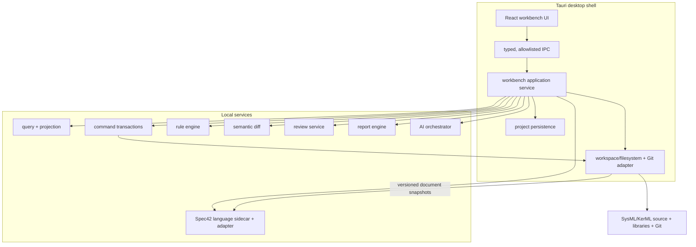
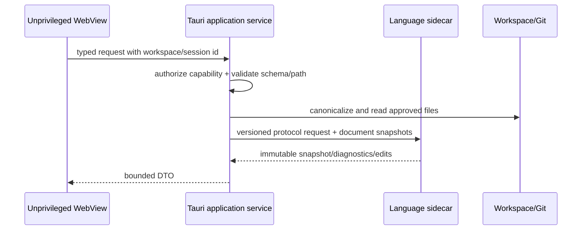
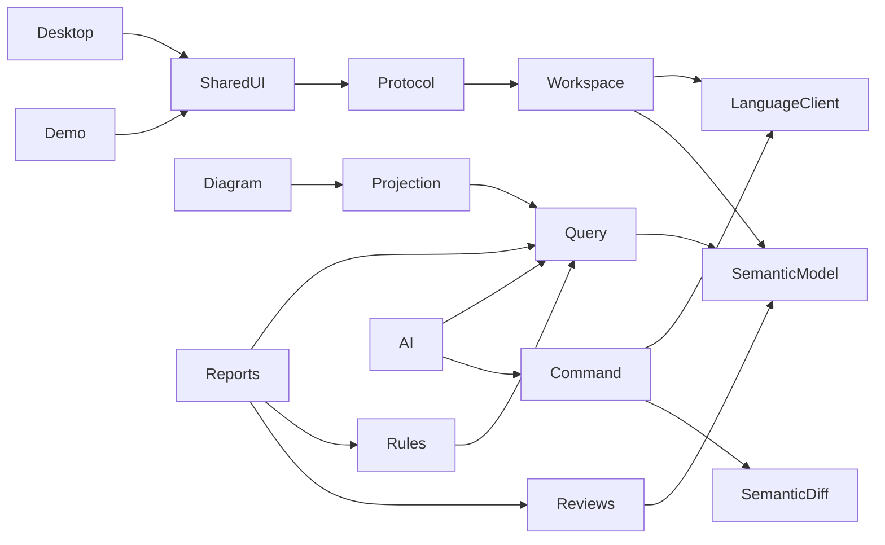

# Architecture Options and Selection

Status: proposed for Gate P0 owner approval

## Recommended architecture

Desktop-first Tauri 2 workbench with a shared React UI, a least-privilege Rust application service, and a pinned Spec42 language sidecar. The workbench builds a small wrapper around the pinned host crate and exposes standard LSP plus versioned `workbench/*` JSON-RPC methods over local stdio; it opens no network port. Keep an optional read-only static web demo. Do not retain browser or GitHub Pages as the production authority surface.



## Shell evaluation

| Option | Fit | Main cost | Decision |
|---|---|---|---|
| VS Code extension first | excellent text/LSP; weak ownership of assurance IA, review/report lifecycle, and packaged product | workbench experience constrained by extension APIs | reject as primary; possible later companion |
| Electron | mature cross-platform Node/filesystem/process model | larger runtime and broad privilege surface; strict sandbox/IPC discipline required | fallback if Tauri WebView incompatibility blocks essential UX |
| Tauri 2 | native packaging, Rust alignment, explicit capability scopes, bundled sidecars, smaller distribution | OS WebView variance and Rust skill/CI requirements | recommended |
| local web + daemon | portable UI and service separation | browser permissions, daemon discovery/auth, larger exposed network surface | useful development/test mode, not primary |
| browser-only | simple hosting | cannot satisfy filesystem, Git, sidecar, keystore, offline, or large-workspace needs safely | reject |
| hybrid monorepo | shared services/UI across desktop and demo | requires explicit feature/authority boundaries | recommended product structure |

Tauri’s official documentation supports [platform-specific bundled sidecars](https://v2.tauri.app/develop/sidecar/) and [allowlisted window/WebView capabilities](https://v2.tauri.app/security/capabilities/). The security model still requires a project threat model, path scopes, validated IPC schemas, restrictive CSP, and no arbitrary shell bridge. Electron remains a fallback only; its own [security guidance](https://www.electronjs.org/docs/latest/tutorial/security) emphasizes sandboxing, context isolation, CSP, current releases, and sender validation.

## Process boundaries



- UI receives no raw filesystem, process, shell, Git, credential, or provider access.
- Application service owns path canonicalization, symlink policy, watching, Git operations, snapshots, and transactions.
- Language sidecar receives versioned document/library content through the application-mediated provider. It receives no workspace credentials, write access, or arbitrary path API.
- The sidecar runs with network denied, a private working directory, bounded CPU/memory/time, and an OS process sandbox where the target platform provides one. Phase 1 adversarial tests attempt path, symlink, process, and network escape.
- AI provider adapter receives only explicitly approved, minimized context.
- A future shared deployment adds authentication and tenant isolation; it is not achieved by exposing the local daemon.

## Responsibility boundaries

| Package/service | Owns | Must not own |
|---|---|---|
| language-client | LSP/host protocol, engine lifecycle, normalized snapshot | reviews, commands, UI state |
| semantic-model | immutable normalized DTOs, source provenance | parsing |
| workspace-service | config, source roots, libraries, watching, index lifecycle | React state |
| command-engine | typed commands, overlay validation, edits, conflict/undo receipt | direct UI rendering |
| query-engine | deterministic model queries | hidden edits |
| projection-engine | query-to-view DTOs | language parsing |
| diagram-engine | canvas interaction and notation adapters | source string writes |
| rule-engine | versioned deterministic findings | AI-only findings |
| semantic-diff | identity-aware baseline comparison | line diff as semantic truth |
| review-service | model-anchored review artifacts and lifecycle | canonical model semantics |
| report-engine | deterministic render + manifest | unversioned external content |
| ai-orchestrator | narrow tools, proposals, approval/audit | direct canonical writes |
| shared-ui | accessible UI components | workspace authority |

## Target dependency graph



Dependency rule: arrows point toward lower-level contracts. UI packages cannot depend on engine-native AST types.

## Projection architecture

A projection is reproducible from:

- semantic snapshot id and source hashes;
- versioned query;
- notation profile;
- filters;
- versioned layout;
- review annotation layer.

```yaml
schemaVersion: 1
id: propulsion-interface-review
name: Propulsion Interface Review
query:
  roots: [Vehicle::Propulsion]
  relationships: [containment, typing, connection, flow]
  depth: 3
filters:
  includeKinds: [PartUsage, PortUsage, ConnectionUsage, InterfaceUsage]
notation: interconnection
layout: layouts/propulsion-interface-review.json
annotations: reviews/propulsion-interface-review.json
```

Diagrams and matrices consume the same projection DTO. React Flow may render initial native diagrams but cannot reconstruct semantics.

## Data ownership

| Data | Authority | Format |
|---|---|---|
| model semantics | SysML/KerML source at pinned libraries | text/KPAR inputs |
| Git baseline | repository commit/tag | Git |
| project configuration | workspace file | YAML |
| identities/saved views/rules/reviews | project artifacts | YAML/JSON |
| layouts | project artifacts | JSON |
| evidence manifests | project artifacts | JSON/YAML |
| generated reports | reproducible output | HTML/PDF + manifest |
| indexes/caches | disposable local state | `.sysml-workbench/` |
| provider credentials | OS keystore/server process | never project files |

## Draw.io target role

Recommended pending Gate P0: export/markup-only.

- no arbitrary XML-to-SysML semantic import;
- no bidirectional authoritative synchronization;
- exported diagram includes snapshot/view manifest;
- returned markup may be attached as evidence or manually translated into review findings;
- local file export is the default;
- any retained remote diagrams.net markup runs in a separate no-IPC WebView with explicit payload/egress consent and is excluded from local-only mode.

Removal remains preferable if an offline isolated export path cannot be maintained without high synchronization/security cost.

## Development and deployment modes

1. Desktop production: Tauri installer, bundled engine/library, local project.
2. Local development: Vite UI plus authenticated loopback service; same typed protocol.
3. Static web demo: read-only, sample snapshots only, no local workspace or provider AI.
4. Future shared service: deferred ADR with authentication, authorization, storage, and collaboration threat model.

## Proposed monorepo

```text
apps/
  workbench-desktop/
  workbench-web-demo/
packages/
  application-protocol/
  language-client/
  semantic-model/
  workspace-service/
  command-engine/
  query-engine/
  projection-engine/
  diagram-engine/
  rule-engine/
  semantic-diff/
  review-service/
  report-engine/
  ai-orchestrator/
  shared-ui/
fixtures/
  language/
  workspaces/
  baselines/
docs/
  adr/
  architecture/
  product/
  revamp/
  security/
  user/
```

Phase 1 should introduce only the packages needed for language/workspace acceptance. Avoid empty-package scaffolding.

## Architecture acceptance at P0

Owner can answer:

- Language authority: pinned Spec42 behind adapter, official Pilot/corpus oracle.
- Multi-file resolution: language service loads configured roots/libraries and returns one immutable workspace snapshot.
- Canonical data: source plus versioned project artifacts; no semantic shadow database.
- Diagram changes: typed command → proposed workspace edits → overlay validation → semantic diff → approval/apply.
- Stable identity: explicit id, otherwise durable workbench key plus semantic locator/fingerprint and alias ledger.
- Unsupported syntax: preserve source and fail edits that cannot prove safe boundaries.
- Retain/delete: editor/UI primitives retained; semantic core/direct patches/Draw.io round-trip replaced.
- Shell: Tauri desktop-first, optional read-only demo.

## Owner decision list

Recommended defaults remain Gate P0 approval items:

1. Name: **SysML Engineering Workbench**.
2. Shell: Tauri desktop-first hybrid.
3. Public web demo: keep read-only.
4. Draw.io: export/markup only.
5. Collaboration: defer beyond Git/review artifacts.
6. First production pilot: OMC4 interface assurance.
7. Pilot content: organizational-boundary communication/interface model.
8. External AI: disabled by default; explicit per-provider enablement and egress approval.
9. OS: macOS arm64/x64 and Windows x64 first.
10. Distribution: signed/notarized packaged installer when release gates pass.

Changing language authority, source canonicality, or mutation approval requires a new ADR. Other decisions may be adjusted before their implementation phase.
