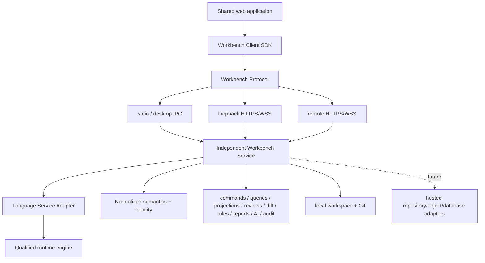
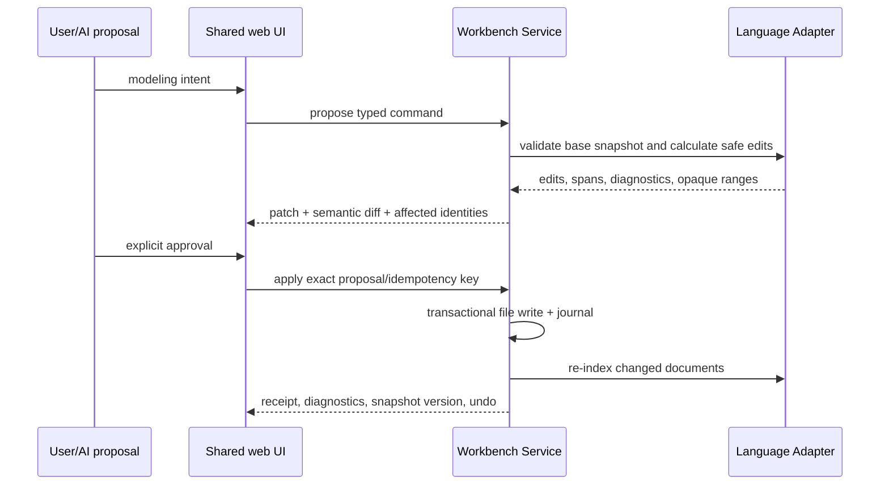

# Architecture Options and Decision Package

## Recommended target

A web-native, transport-neutral client/service product:

- shared React/Monaco web application;
- generated Workbench Client SDK;
- versioned Workbench Protocol;
- independently executable Workbench Service;
- product-owned language adapter, normalized semantics, identity, command, query/projection, review, diff, rule, report, AI, and audit services;
- local filesystem/Git and future hosted persistence adapters;
- deployment profiles for public web evaluation, browser + local companion, Tauri desktop, and future managed hosting.



## Alternatives assessed

| Option | Benefits | Blocking concern | Decision |
|---|---|---|---|
| browser-only static app | zero install, easy evaluation | no safe arbitrary local files/Git/processes; browser-local authority risk | retain only Profile A |
| VS Code-first extension | excellent language/text/Git host | engineering review/product UX constrained by editor extension contract; non-modelers underserved | optional future client, not product center |
| Tauri-centered desktop | offline/filesystem/process/keystore packaging | couples UI/services to shell; weak browser/hosted evolution | reject center; retain Profile C host |
| Electron-centered desktop | mature Node/process ecosystem | same center coupling plus larger privilege/runtime surface | contingency packaging only |
| browser + local companion | browser usability with local authority/processes | pairing/origin/loopback security is nontrivial | first-class Profile B |
| independent service + multiple clients/transports | one semantic core, headless testing, deployment evolution | protocol/versioning/authorization responsibility | selected |

## Service responsibility boundary

The Workbench Service owns:

- workspace configuration, source/library discovery, Git/baseline state;
- candidate-independent language adapter lifecycle;
- normalized semantic snapshots and freshness;
- stable identities and alias receipts;
- typed command proposal/validation/apply/undo;
- queries/projections;
- rules, reviews, semantic diff, reports/evidence;
- AI tool mediation and audit;
- authorization and deployment-capability enforcement.

React owns presentation, interaction state, accessibility, and optimistic display only. It does not parse SysML, calculate semantic patches, resolve references, or persist authoritative reviews.

## Protocol boundary

LSP remains the editor-intelligence protocol between appropriate client/service components. Workbench operations use product schemas over JSON-RPC 2.0 for bidirectional transports and bounded HTTPS artifact endpoints. Initialize negotiates versions/capabilities; all apply operations are stale-base-checked and idempotency-protected. See ADR-006.

## Source-edit sequence



No diagram or AI component writes source directly.

## Target logical packages

```text
apps/
  workbench-web/
  workbench-desktop/
  workbench-local-companion/
  workbench-service/
packages/
  workbench-client-sdk/
  workbench-protocol/
  language-adapter/
  semantic-model/
  workspace-service/
  command-engine/
  query-engine/
  projection-engine/
  diagram-engine/
  rule-engine/
  semantic-diff/
  review-service/
  report-engine/
  ai-orchestrator/
  shared-ui/
fixtures/
docs/
```

Exact folders wait until P1 proves build/runtime constraints; responsibility boundaries do not.

## Deployment profiles

| Profile | Practical function | Authority |
|---|---|---|
| A public web evaluation | sample navigation/query/report/baseline comparison | packaged sample only |
| B browser + local companion | full local authoring/review with paired service | local source/Git |
| C Tauri desktop | fully offline packaged B-equivalent | local source/Git |
| D managed hosted | future distributed authoring/review | hosted workspace/repository |

The same UI and protocol operate in all profiles. Capability negotiation, not separate semantic code, determines available actions.

## Product-owned versus replaceable

| Product-owned | Replaceable/qualified |
|---|---|
| Workbench Protocol/Client SDK | runtime language engine |
| normalized semantic DTOs | diagram layout implementation |
| stable identity/alias receipts | desktop packaging host |
| typed commands/source receipts | local/hosted persistence adapter |
| query/projection schemas | report renderer implementation |
| reviews/diff/rules/reports/audit contracts | optional AI provider |

## Owner decisions

Recommended:

1. working name `SysML Engineering Workbench`;
2. Profiles B and C production, A public evaluation, D future;
3. Draw.io export/markup-only;
4. real-time collaboration deferred to Git/review artifacts;
5. OMC4 interface assurance first pilot;
6. provider AI disabled by default;
7. macOS/Windows first;
8. signed local-companion and desktop packages at P7;
9. official `2026-05` Phase 1 qualification baseline;
10. runtime engine selected only at the Phase 1 gate.

## Acceptance

Revised P0 passes when the owner can answer the 15 questions in `16-owner-decision-packet.md`, approves/changes the ten consequential choices, and authorizes only the bounded P1 qualification/service scope.
