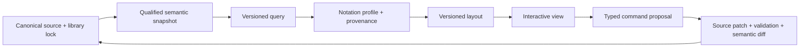

# Graphical Notation and Projection Review

## Authority and labels

The [official SysML v2 release](https://github.com/Systems-Modeling/SysML-v2-Release) contains the adopted language material, graphical-notation introduction, examples, libraries, and reference visualization inputs. The [OMG SysML 2.0 specification](https://www.omg.org/spec/SysML/) is the semantic authority. The Pilot is executable evidence. Commercial and open products are pattern donors only.

Every workbench view is visibly classified:

| Class | Meaning | Allowed claim |
|---|---|---|
| normative/reference | mark and semantic mapping traced to official specification/release material | “SysML v2 reference notation” with citation/profile |
| conventional | useful SysML v1, MBSE, IDE, network, CAD/CAE, or review convention | “conventional” with origin/legend |
| analytical | workbench query result, quality overlay, matrix, diff, neighbourhood, or assurance view | “workbench analytical view” |

Mixed views require a legend identifying each analytical/conventional overlay. No custom node-link graph is labeled official merely because its nodes are SysML elements.

## Projection contract

A projection stores roots, relationship traversal, depth, filters, notation profile, layout reference, annotation reference, and exclusions. It never stores an authoritative semantic graph. Layout keys use stable workbench identities.

## Production view profiles

| Profile | Questions answered | Primary marks | Provenance class | Editing boundary | Phase |
|---|---|---|---|---|---|
| general model structure | what exists, owns, types, specializes, or depends on what? | definitions/usages, containment, typing, specialization | reference plus analytical filters | create/rename/move/retype via commands | P4 |
| interconnection/interface | who exchanges what across which boundary? | parts, ports, interfaces, connections, item flows | reference notation plus conventional interface data | port/interface/connection/flow commands | P3–P5 |
| requirement/traceability | what is required, satisfied, refined, verified, or missing? | requirements, satisfy/derive/verify, gaps | reference relationships plus analytical status | relationship commands; rule overlays read-only | P4–P5 |
| action flow | what behavior, control, data, and allocations occur? | actions, successions, flows, pins/parameters where supported | reference | bounded command profile | P4 after engine profile |
| state transition | what states, events, guards, effects, and modes exist? | states, transitions, triggers, guards | reference | bounded command profile | P4 after engine profile |
| verification context | which cases, subjects, objectives, methods, results/evidence exist? | verification cases, requirements, subjects, evidence links | reference plus analytical readiness | model commands plus evidence manifests | P5 |
| interface register/network | which endpoints, protocols, units, owners, risks, and status need control? | table/network/map | conventional/analytical | schema-backed commands only | P5 |
| model neighbourhood | what directly/indirectly affects this selection? | radial/layered relationship graph | analytical | navigation/filter only by default | P2/P4 |
| baseline semantic diff | what meaning changed and what is impacted? | before/after, overlays, categorized change list | analytical | review/disposition, not direct merge | P5 |
| matrices/tables | where are coverage, ownership, compatibility, or quality gaps? | cells, groups, filters, counts | analytical | bulk commands with preview | P4–P5 |

## Notation decisions

### Compartments

Use official/reference compartments when mapped. Add workbench sections for identity, provenance, diagnostics, reviews, and Git only with a distinct analytical header/icon and legend. Owned, inherited, redefined, subsetted, and derived members must not be visually flattened.

### Connections and flows

Connection topology and item-flow semantics are separate facts. Direction arrows must state whether they show semantic direction, flow direction, navigation, or change impact. Interface views expose source/target role, exchange item/type, units, protocol, rate/capacity, modes, and requirement/verification links through inspectable properties/table columns rather than edge decoration alone.

### Requirements and verification

Reference relationship marks show modeled relationships. Coverage colors/badges are analytical rule results and include rule-pack version and non-color status. Indirect satisfaction/verification uses a distinct path style and expandable path explanation.

### Behavior

Do not reuse generic flowchart symbols when official constructs have different semantics. Unsupported event/message/guard/effect detail remains source-visible and opaque rather than rendered as an invented transition.

### Baseline comparison

Use stable identity to classify create/delete/rename/move/type/value/relationship changes. Layout-only changes remain a separate layer. User can switch among source diff, semantic list, diagram overlay, and impact table.

## SysML v1 and industry conventions

Retain practitioner-friendly conventions only when meaning is explicit:

- nested decomposition and compartments;
- N2/interface matrices;
- requirements coverage matrices;
- context boundaries and external actors;
- allocation and responsibility swimlanes;
- mode/state tables;
- legends, title blocks, revision/baseline metadata.

Do not import v1 terms such as block/instance as silent aliases for v2 definition/usage, nor assume v1 diagram categories define v2 semantics.

## Interaction and accessibility

- selection synchronizes source, explorer, properties, tables, diagnostics, and reviews by stable identity;
- every diagram fact has a table/tree alternative;
- keyboard commands cover navigate, expand/collapse, inspect relationships, add comment, and reveal source;
- status uses icon/text in addition to color;
- zoom is not required to read selected-element properties;
- reduced motion disables animated layout transitions;
- exports include title, scope, baseline, legend, provenance class, exclusions, and accessible tabular appendix where applicable.

## Validation

Each profile receives:

- semantic mapping golden tests;
- official-example comparison where licensed;
- provenance and legend checks;
- source-selection round trip;
- layout determinism and identity retention;
- edit-to-command/source-patch tests;
- unknown/unsupported element tests;
- visual regression and accessibility checks;
- export manifest reproducibility.
