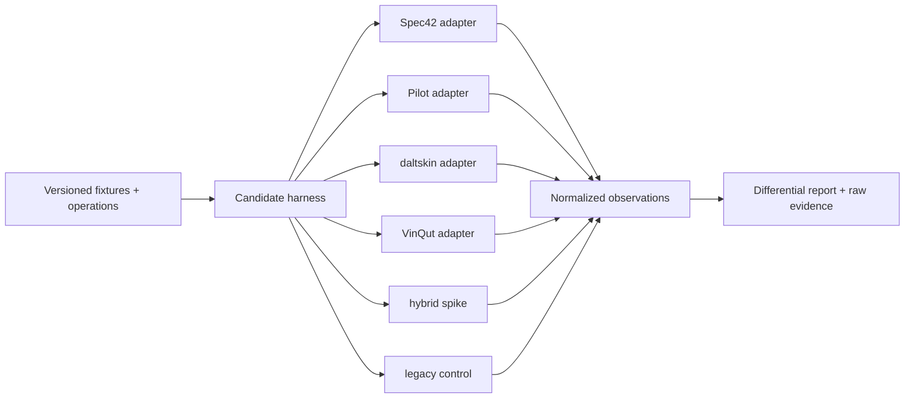

# Engine Comparative Qualification Plan

Phase 1 name: **Engine Qualification and Workbench Service Foundation**.

No candidate is the production runtime at Phase 0. The exact candidate pins and official reference baseline are frozen in ADR-001. Any pin change creates a new run id and invalidates prior selection evidence for that candidate.

## Candidate matrix

Values are Phase 0 evidence/hypotheses, not pass results.

| Candidate | Semantic lineage | Current evidence | Principal opportunity | Principal risk | Qualification posture |
|---|---|---|---|---|---|
| Spec42 `v0.46.0` `a3f066e` | independent Rust implementation | active LSP/CLI, explicit partial conformance, MIT | packaging, performance, editor/CI parity, host/snapshot/indexing ideas | pre-1.0 churn and semantic divergence | leading candidate; full suite |
| official Pilot `2026-05` `fa709f2` wrapped | official Xtext/EMF reference implementation | broad official behavior, standard libraries, EPL | fidelity/oracle proximity, semantic adapters | Eclipse/Java packaging, startup/memory, API coupling | full suite and oracle; service wrapper prototype |
| daltskin `v0.24.0` `6838e9c` | independent TypeScript/ANTLR implementation | active LSP/tooling, MIT | web/TS integration and accessible instrumentation | release skew/semantic completeness | full suite if build reproducible |
| VinQut `373dfb9` | wrapper around Pilot components | working Java LSP/diagram evidence, MIT wrapper | proof of wrapper feasibility | bundled version/license mismatch and reported library startup | rebuild against official pin; full wrapper subset |
| official-component hybrid | product wrapper around official parser/resolver/EMF components | architecture spike required | retain official behavior while exposing stable DTOs | ambiguous authority and maintenance surface | qualify only with responsibility map |
| current workbench parser | hand-written subset | current tests and known limitations | negative control and migration comparison | no KerML/full workspace semantics, destructive recovery risk | control only; cannot win |

## Phase 0 evidence matrix

Legend: `E` public/repository evidence exists but still needs harness proof; `R` strong official-reference lineage; `P` known partial/limited; `U` unverified/unknown; `N` known absent/not suitable; `S` architecture spike required. Entries are not qualification results.

| Criterion | Spec42 | Pilot service | daltskin | VinQut | official hybrid | legacy control |
|---|---|---|---|---|---|---|
| specification version | E, release mapping to verify | R, 2026-05 | E, stated release to verify | P, bundled pin must be replaced | S, exact 2026-05 | P, selected subset |
| KerML coverage | E/P | R | E/U | inherited Pilot/P | S/R potential | N |
| SysML coverage | E/P | R | E/U | inherited Pilot/P | S/R potential | P |
| standard library loading | E | R | E | E but slow reported | S | P/optional |
| KPAR | U | R | U | U | S | N |
| multi-file imports | E | R | E | E | S | N/P |
| aliases/visibility | E/U | R | E/U | inherited Pilot | S | P |
| definition/usage semantics | E/P | R | E/U | inherited Pilot | S | P |
| diagnostics | E | R | E | E | S | P/shallow |
| exact source spans | E/U | R/U | E/U | inherited Pilot/U | S | P |
| formatting preservation | E/U | U | U | U | S | N |
| comments preservation | U | U | U | U | S | N/not lossless |
| metadata preservation | E/P | R | E/U | inherited Pilot | S | P/recovery |
| incremental editing | E | R/Xtext | E | E | S | P/single doc |
| rename | E | R/Xtext | E | E | S | P/ad hoc |
| references | E | R/Xtext | E | E | S | N |
| completion | E | R/Xtext | E | E | S | snippets only |
| semantic tokens | E | R/Xtext | E | E | S | lexical only |
| semantic snapshot access | E, host API to qualify | R, EMF adapters | U | U/Pilot objects | S | P/dual shallow |
| command/edit generation | E/U | R/Xtext edits, product fit U | U | U | S | P/ad hoc |
| performance | E/bench claims | U, packaging concern | E/bench claims | P, slow library report | S | E small only |
| startup | E | U | E/U | P | S | E |
| memory | U | U | U | U | S | E small only |
| crash recovery | U | U | U | U | S | N |
| license | MIT | EPL-2.0 | MIT | MIT wrapper + Pilot obligations | EPL/product code TBD | repo root license unresolved |
| redistribution | likely with notices | possible with EPL obligations | likely with notices | rebuild/audit required | legal/component audit | unsuitable as product authority |
| cross-platform packaging | E/Rust | S/Java 21 | E/Node/TS | E/Java 21 | S | E/web only |
| maintenance health | E active | R active official | E active | E active | product-owned burden | active locally but wrong scope |
| upgrade volatility | P/pre-1.0 | P/monthly official evolution | P/pre-1.0 | P/wrapper + Pilot | P/high | product-owned high burden |
| test coverage | E, inspect depth | R, official suites | E, inspect depth | E/U | S | E subset |
| official corpus agreement | U, must measure | oracle evidence, still discrepancy-capable | U | inherited version-dependent | U | known limited |

This matrix justifies running all candidates; it does not justify selecting one.

## Normalized scoring schema

Every row records `pass`, `conditional`, `fail`, or `not-applicable`, evidence path, duration/resource data, candidate pin, adapter build, OS, and official release pin.

| Dimension | Required observations |
|---|---|
| version/coverage | supported SysML/KerML release, grammar/metamodel mapping, capability profile, unsupported constructs |
| libraries/packages | standard library, KPAR read/load/export where applicable, release lock, shadowing |
| workspace semantics | source roots, multi-file imports, aliases, visibility, recursive imports/cycles, incremental invalidation |
| definition/usage semantics | typing, specialization, redefinition, subsetting, multiplicity, feature chains, derived properties |
| diagnostics | deterministic code/severity/range/message, recovery, introduced/resolved delta |
| source fidelity | exact spans, comments, metadata, Unicode, formatting, unknown syntax, safe-edit ranges |
| LSP | completion, hover, definition, references, rename, tokens, symbols, formatting, code actions |
| semantic access | stable normalized snapshot input, relationship completeness, source provenance, no AST leakage |
| mutation support | edit calculation, format preservation, conflict/stale-base behavior, command validation |
| performance | cold/warm startup, first content, incremental p50/p95, memory, 1k/10k/50k, diff inputs |
| resilience | timeout, cancel, crash, restart, corrupted cache, partial document, concurrent changes |
| distribution | macOS/Windows build, stdio/loopback service, artifact size/hash/SBOM, offline operation |
| governance | license/redistribution, release cadence, maintainer health, upgrade volatility, tests, security posture |
| oracle agreement | official corpus diagnostic/snapshot agreement, classified deviations, adopted issue resolution handling |

## Harness

The harness starts each candidate in an isolated process, provides identical workspace material and timed operation scripts, captures raw stdout/stderr separately, and normalizes only after raw evidence is sealed. Candidate-specific adapter code may translate; it may not invent missing semantics.

## Mandatory fixture/operation suites

1. official release examples selected under recorded license/provenance;
2. exact official libraries and KPARs;
3. isolated grammar/semantic fixtures for all claimed profiles;
4. multi-file imports, aliases, visibility, cycles, definitions/usages;
5. malformed, incomplete, Unicode, comments, metadata, formatting, unknown syntax;
6. clean open/reopen, incremental edits, branch/file changes, corrupted cache;
7. diagnostics, symbols, completion, hover, definition, references, rename, tokens, formatting;
8. semantic snapshots with source provenance;
9. proposed edits, stale-base conflicts, opaque-range rejection, undo inputs;
10. 1k/10k/50k generated and representative workspaces;
11. crash, timeout, cancellation, restart, and packaging;
12. license notice, SBOM, artifact hash, clean-machine/offline reproducibility.

Golden outputs include raw candidate outputs and normalized diagnostics/snapshots. Updates require a reason, official reference, and reviewer.

## Disagreement protocol

When candidates differ:

1. freeze fixture and all pins;
2. determine whether formal specification/adopted resolution decides the case;
3. compare official release example/library representation;
4. run matching Pilot;
5. classify `candidate defect`, `Pilot defect/limitation`, `specification ambiguity`, `version skew`, `adapter defect`, or `profile exclusion`;
6. open an evidence record with source sections/issues and owner disposition;
7. never majority-vote semantics.

## Performance gates

On the stated reference laptop:

| Measure | Gate |
|---|---:|
| medium warm reopen | <3 s |
| medium first useful explorer data | <5 s |
| ordinary incremental diagnostics | <500 ms p95 |
| definition | <300 ms p95 |
| 50k workspace remains indexable | no crash; bounded measurement and mitigation |
| idle/warm memory | measured and budget proposed before selection |
| restart after forced crash | service recovers; no false-current snapshot |

The harness also records cold library index separately from workspace index. A candidate may receive `GO WITH CONDITIONS` only when the limitation is bounded, visible, and compatible with the selected production profile.

## Phase 1 service deliverables

- product-owned Language Service Adapter;
- candidate harness and differential runner;
- normalized Workbench Protocol/Client SDK schemas;
- standalone Workbench Service;
- stdio and authenticated loopback transports;
- capability negotiation;
- workspace open/index/status/close;
- diagnostics, symbols, definitions/references, completion/hover/tokens where supported;
- standard library/KPAR loading;
- timeout/crash/restart handling;
- mandatory fixture CI and benchmark bundle.

No broad application-shell redesign belongs in P1.

## Decision gate

The evidence report recommends exactly one:

- **GO** — selected runtime passes required profile;
- **GO WITH CONDITIONS** — selected runtime passes a bounded declared profile and all preservation/failure gates;
- **NO-GO** — none is safe/maintainable enough; architecture/backlog returns to owner;
- **HYBRID GO** — responsibilities split, with a table naming one authority for each operation and prohibiting silent fallback.

Required selection packet: scorecard, blocking results, discrepancies, performance distributions, license/SBOM decision, supported profile, adapter contract version, operational failure behavior, migration/deletion impact, exact pins, and ADR-001 amendment.
