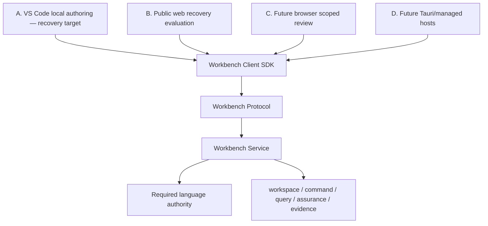

# Deployment and Access Strategy

Status: amended for recovery; production profile selection deferred

Active authorities:

- `docs/adr/ADR-003-client-service-and-deployment-architecture.md`
- `docs/adr/ADR-008-deployment-profiles.md`
- `docs/revamp/37-recovery-acceptance-contract.md`

## One service architecture, staged clients

The service, protocol, identity, command, assurance, and evidence contracts are
shared. No client host contains a second semantic implementation or writes
source outside the typed-command boundary.

## A — VS Code local authoring

Recovery target for source-canonical engineering work.

Use native VS Code capabilities for:

- folder/workspace opening;
- Explorer and Search;
- SysML/KerML text editing;
- diagnostics and Problems;
- SCM/diff when Git is configured;
- commands, settings, progress, cancellation, and workspace trust.

Use webviews only for notation-specific projections, assurance views, and
source-patch review. A packaged VSIX must pass Recovery Gates R2-R6 before this
profile receives a production claim.

Git is optional. Non-Git workspaces retain source, language, query,
Interconnection, interface, and verification capabilities; baseline and
commit-specific operations are unavailable.

## B — Public web recovery evaluation

Purpose: inspect recovery concepts, pair with a technical local companion, and
open packaged or explicitly selected evaluation workspaces.

Constraints:

- no production-authoring claim;
- Pages source authoring is disabled until self-hosted editor assets/workers and
  CSP behavior pass exact-artifact qualification;
- the element map and inventory are diagnostic projections, not SysML notation
  or engineering matrices;
- no arbitrary filesystem authority in public JavaScript;
- strict CSP, no persistent sensitive model state, and no provider AI.

`?legacy=1` remains a read-only rendering/regression reference. Its parser and
browser store are not authoritative.

## C — Future browser scoped review

Potential profile for non-modelers after R6. Authorized users may receive
published/scoped views and reports, relationship navigation, assigned findings,
dispositions, baseline comparisons, and evidence downloads through the same
protocol.

This profile requires authentication, authorization, source/baseline scope,
and its own exact-artifact/practitioner evidence. It does not become source
authority.

## D — Future packaging and hosted profiles

### Tauri desktop

Deferred packaging host for the same client/service contracts. It may provide
an offline installer, workspace picker, process lifecycle, keystore, and OS
integration. Tauri handlers contain no semantic or source-writing logic.

### Managed hosted

Deferred authenticated deployment using repository, object, and database
adapters behind the same protocol and identity contracts. No hosted
implementation begins before the local recovery vertical slice passes.

## Local companion security controls

The retained companion technical boundary requires:

1. a canonical selected workspace under an allowed root;
2. explicit IPv4/IPv6 loopback bind and OS-selected port;
3. one-time, short-lived pairing intent for an exact trusted origin;
4. fragment bootstrap scrubbing;
5. browser Local Network Access annotation and bounded recovery;
6. origin/audience-bound credentials and opaque workspace handles;
7. Host/Origin allowlists, CSRF/WebSocket validation, no wildcard CORS;
8. token/model-log redaction, payload/rate limits, and deny-by-default egress;
9. expiry, restart, origin change, and permission elevation requiring renewed
   confirmation.

These controls prove a security boundary. They do not prove a usable product.

## User and permission matrix

| Capability | Author | Engineer/reviewer | Chief/assurance | PM/stakeholder |
|---|---:|---:|---:|---:|
| navigate authorized source/views | yes | yes | yes | scoped |
| inspect source/semantics | yes | policy | policy | optional |
| propose text/graphical commands | yes | policy | no by default | no |
| approve source mutation | protected | policy, protected | no by default | no |
| run queries/rules | yes | yes | yes | published/bounded |
| create/respond to findings | yes | yes | yes | invited |
| freeze review scope | policy | chair | yes | no |
| approve/reject dispositions | no self-approval by default | assigned | yes | invited |
| compare Git baselines | when Git configured | when authorized | yes | published |
| generate reports | yes | yes | yes | approved download |
| configure providers/egress | administrator | no | no | no |

The Workbench Service enforces capabilities. Client hiding is explanatory, not
access control.

## Secret, network, and privacy boundaries

- credentials remain in the extension/local service keystore or future hosted
  secret manager, never source or browser storage;
- external providers are disabled by default and remain frozen through R6;
- UI reports actual offline/local/external state;
- telemetry is off by default;
- operational logs exclude source, prompts, evidence contents, tokens, and
  personal details by default;
- remote/shared profiles require authentication before workspace enumeration.

## Packaging and distribution posture

- source CI may build and test technical artifacts;
- the unsigned companion remains an internal technical candidate;
- public binary distribution, signing/notarization, Windows qualification,
  updater work, and support claims are frozen until R6;
- Pages deployment is a recovery/evaluation surface, not a release channel;
- no artifact name, version, landing page, or documentation may imply product
  release readiness.

## Verification

Each implemented profile requires its own:

- component evidence;
- service/transport evidence;
- exact delivered-artifact UI evidence;
- practitioner evidence where the profile serves people.

The recovery profile must also prove non-Git degradation, offline/local
boundaries, malicious-origin and token controls, path/symlink rejection,
capability negotiation, source-preserving mutation, saved-layout restart, and
version mismatch failure.
