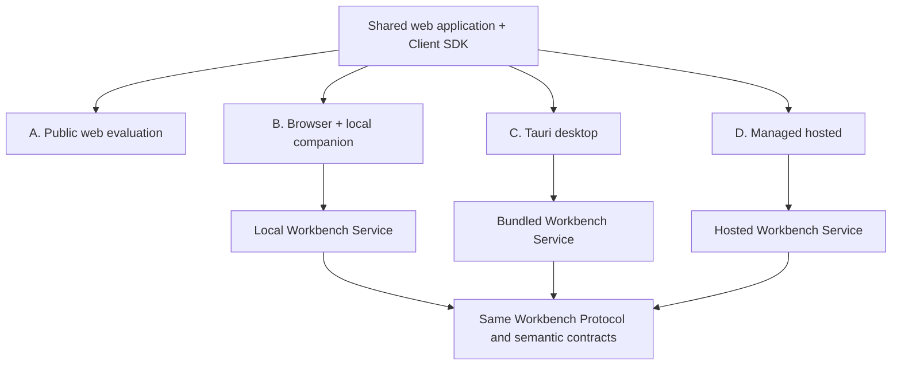

# Deployment and Access Strategy

## One product, four profiles

### A — Public web evaluation

Purpose: discover product concepts, install/launch the companion, and enter
the explicit packaged compatibility sample. Expanded sample queries, reference
views, baseline comparison, and sample reports remain a Profile A backlog item.

Constraints: no arbitrary local folders; no provider AI; no claim of authoritative local editing; sample/source provenance embedded; strict CSP; no persistent sensitive model state.

The deployed GitHub Pages URL loads the modern shared workbench shell in this
mode when no companion bootstrap is present. `?legacy=1` is a separate
read-only compatibility sample, not the primary Pages UI.

### B — Browser + local companion

Supported production-candidate profile for low-friction authoring and review.
The same GitHub Pages UI elevates from Profile A only after an explicitly
launched local Workbench Service completes one-time pairing. This is the
recommended distribution path while native installers are unsigned.

Local-only functions:

- open/watch arbitrary approved folders;
- use local Git and commits;
- run qualified local language engines/libraries;
- generate reports through local binaries;
- use OS keystore and optionally approved local AI;
- access private evidence files through scoped handles.

Security handshake:

1. companion validates a selected workspace under a canonical allowed root;
2. companion starts on an OS-selected IPv4 loopback port and opens a one-time pairing intent for the exact Pages origin;
3. the intent carries the loopback origin and pairing secret in the URL fragment, which is not part of the HTTP request and is scrubbed after consumption;
4. the browser performs the exact-origin Private Network Access preflight and pairing request;
5. companion issues short-lived audience/origin-bound session credentials and an opaque workspace handle;
6. client negotiates protocol/capabilities and opens only that handle;
7. expiry, origin change, restart, permission elevation, or trust change requires renewal/confirmation.

Required controls: explicit IPv4/IPv6 loopback bind, Host/Origin allowlists, anti-DNS-rebinding tests, CSRF protection, WebSocket Origin and token validation, payload/rate limits, no wildcard CORS, token redaction, no model logs, egress deny-by-default, visible connection/network state.

### C — Tauri desktop

Optional native profile: signed, fully offline macOS 13+ Apple Silicon
installation with integrated workspace picker, process lifecycle, updater
policy, and crash recovery. It embeds the same built UI and starts the same
loopback Workbench Service with short-lived pairing credentials. Tauri
capabilities grant only dialog, sidecar, and typed application commands. No
semantic logic is implemented in Tauri handlers.

### D — Managed hosted

Future profile for authenticated distributed work. It uses remote HTTPS/WSS, tenant/workspace authorization, immutable repository/baseline services, object evidence storage, job execution, audit retention, and optional collaboration. The service implements the same application contracts; persistence/identity adapters may change only behind ADR-005 boundaries.

No hosted implementation begins before local semantic/command/report contracts pass their gates.

## User and permission matrix

| Capability | Author | Engineer/reviewer | Chief/assurance | PM/stakeholder |
|---|---:|---:|---:|---:|
| navigate approved workspace/views | yes | yes | yes | yes |
| inspect source/semantics | yes | policy | policy | optional |
| edit text/propose commands | yes | policy | no by default | no |
| apply source mutation | yes, protected | policy, protected | no by default | no |
| run queries/rules | yes | yes | yes | published/bounded |
| create/respond to findings | yes | yes | yes | invited comments |
| freeze review scope | policy | chair only | yes | no |
| approve/reject dispositions | no self-approval by default | assigned | yes | invited decision |
| compare baselines | yes | yes | yes | published baselines |
| generate reports | yes | yes | yes | download approved |
| configure providers/egress | administrator only | no | no | no |

The Workbench Service enforces roles and workspace capabilities. Client controls are explanatory only.

## Availability to non-modelers

Without local installation, authorized hosted/public users must be able to:

- open published/scoped views and reports;
- navigate identity-backed relationships and properties;
- inspect diagnostics/quality findings at the shared baseline;
- compare two published baselines;
- comment or create a permitted finding;
- respond to and approve/reject an assigned disposition;
- download a reproducible evidence/report package.

Authoritative local-folder editing still requires B or C.

## Secret, network, and privacy boundaries

- credentials live in companion/desktop OS keystore or hosted secret manager, never web storage/source;
- external provider use is disabled by default, provider-specific, per-action visible, and auditable;
- the UI always displays `offline`, `local-only`, or named external connection state;
- no telemetry by default;
- logs contain ids/status/timing, not source text, prompts, evidence contents, tokens, or personal details by default;
- audit retention is configurable and separable from operational logs;
- remote/shared deployment requires authentication before workspace enumeration.

## Packaging and distribution decision

- P1 ships development/test service artifacts only, with exact hashes and SBOM;
- P7 continues to retain a Developer ID signed and Apple-notarized macOS 13+
  arm64 Tauri `.app` and DMG as an optional future native channel;
- Profile B is the recommended near-term delivery path because the portable
  companion does not require Apple signing and the Pages host never becomes
  model authority;
- the public evaluation site is independently deployable but becomes
  authoritative for a private workspace only through the paired local service;
- auto-update is opt-in/policy-controlled and verifies signatures; offline programs can use pinned manual packages;
- managed hosted distribution remains an owner-approved future program.

## Verification

Deployment conformance runs the same service contract suite on all implemented transports plus:

- clean install/uninstall/recovery;
- offline C workflow;
- B pairing/revocation/restart/origin change;
- malicious web origin, DNS rebinding, token replay, CSRF/CSWSH, path traversal, symlink escape;
- privilege/role matrix;
- provider egress and network indicator;
- report sanitization/CSP;
- large workspace responsiveness and job cancellation;
- version mismatch and protocol downgrade rejection.

See ADR-003, ADR-006, ADR-008 and `docs/security/*`.
