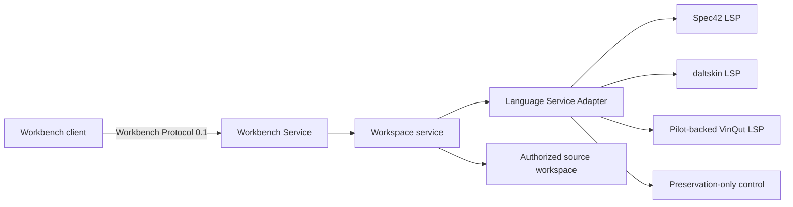

# Phase 1 Foundation Status

- Date: 2026-07-25
- Phase 0 baseline: `ade6e07fd1cecd615f21d42744dfd56380a42934`
- Branch: `codex/sysml-workbench-phase1-engine-service`
- Gate state: **accepted with bounded conditions**
- Runtime selection: **HYBRID GO — VinQut semantic authority + Spec42 authoring assistance**
- Production claim: **none**

Phase 1 now establishes an independently executable, engine-neutral service,
records comparative observations, and closes Gate P1 with the bounded decision
in `18-phase1-gate-decision.md`. ADR-001 is amended. Phase 2 is authorized; no
production claim is made.

## Implemented boundary

The new packages provide:

- a versioned JSON-RPC protocol and TypeScript Client SDK;
- initialization and post-index capability negotiation;
- safe workspace configuration, model-configuration selection, file discovery,
  limits, hashing, deterministic reopen, and one active engine session;
- diagnostics, document symbols, definition, references, hover, and completion
  through normalized DTOs;
- an LSP stdio process adapter with timeouts, bounded output capture, request
  handling, diagnostics settling, health, and crash detection;
- a preservation-only control that reports a blocking diagnostic instead of
  inventing semantics;
- standalone NDJSON stdio and authenticated loopback HTTP/WebSocket transports;
- exact Origin and loopback Host checks, pairing, bearer and CSRF credentials,
  message limits, and security headers;
- a pinned candidate manifest and differential qualification runner;
- a three-file workspace fixture with a cross-file private import and type
  reference;
- CI that proves the unconfigured engine lane fails closed.

The existing React application and hand-written parser remain untouched by this
slice. They are not connected to the new service and do not gain authority.

## Candidate observation

All results use the official 2026-05 release at
`de1070ae8e79c21532b8004fc663d47b35d0e9fa` and Pilot at
`fa709f28dfd49dfdb7ee83e4e19da2f57e0eb3aa`. The fixture source was corrected
from unsupported shorthand `import` to official `private import` syntax after
the Pilot-backed candidate diagnosed it.

| Candidate | Exact pin | Valid sample | Definition | References | Hover | Completion | Duration |
|---|---|---:|---:|---:|---:|---:|---:|
| Spec42 v0.46.0 | `a3f066ee4095a0eb8b37545ffd4846d42804658a` | 0 diagnostics | cross-file | 2 precise | rich | 41 | 228 ms |
| daltskin v0.24.0 | `6838e9c775f15fc3a3662ea294f13809a1c21577` | 0 diagnostics | cross-file | 2; range disagreement | advertised but null | 44 | 224 ms |
| VinQut + Pilot 2026-05 | `373dfb960860c3ac259f56169ddabc06d2847eca` + Pilot pin | 0 diagnostics | cross-file | 16 noisy/duplicate | present | 0 | 4,648 ms |
| direct Pilot service | Pilot pin | blocked | blocked | blocked | blocked | blocked | not packaged |
| official hybrid | Pilot pin | unimplemented | — | — | — | — | — |
| legacy parser control | `638e5aa1cc63ddb3a1c770f36432d6acedfbc541` | control only | — | — | — | — | — |

The normalized evidence is
`docs/revamp/phase1-qualification-observation.json`. Raw LSP/stdout/stderr
streams were sealed before normalization and identified by SHA-256; they remain
local because they contain machine paths and candidate-native output.

Spec42 leads this narrow observation. It is not selected: the observation does
not cover the official corpus, source preservation, standard libraries/KPAR,
incremental behavior, rename/formatting edits, normalized semantic snapshots,
large workspaces, clean restart, cross-platform packaging, or redistribution.

A second clean-process run used the versioned mandatory fixture manifest:

| Candidate | Multi-file | standard library | malformed recovery | preservation control |
|---|---:|---:|---:|---:|
| Spec42 | pass, 0 diagnostics | **fail**, unresolved import/type warnings | pass, deterministic error | byte-identical inventory test |
| daltskin | pass, 0 diagnostics | pass, 0 diagnostics | pass, deterministic error | byte-identical inventory test |
| VinQut + Pilot | pass, 0 diagnostics | **fail**, unresolved import/type errors | pass, deterministic error | byte-identical inventory test |

The standard-library probe imports `ScalarValues::Real` using syntax present in
the official 2026-05 release. Spec42's bundled 2026-04 library was materialized
and explicitly supplied, but resolution still failed. VinQut did not load its
Pilot libraries in this isolated workspace. Daltskin is the only candidate that
returned zero diagnostics, but its exact standard-library release alignment
still requires proof. These are blocking discrepancies, not warnings to waive.
The normalized record is
`docs/revamp/phase1-fixture-qualification-observation.json`.

## Packaging and license observations

| Candidate | Reproduction observation | Open release issue |
|---|---|---|
| Spec42 | official macOS arm64 v0.46.0 artifact ran locally; downloaded artifact SHA-256 `0ea001a7478b893a0e4dd3fb6b36ec15b9ed17f79d5af14147dc563967bdd751` | clean-machine Windows/macOS package, SBOM, notices |
| daltskin | exact source pin installed and built with Node 22 | upstream install reported five high dependency findings; product redistribution/SBOM unresolved |
| VinQut | wrapper rebuilt against exact Pilot pin after including the split model and logic jars; local jar SHA-256 `deb1ce86914c822c5b1865bc4b03e8598b595105e85b19f386e46cf9ab1926d3` | wrapper NOTICE and current official Pilot license evidence disagree; redistribution is blocked pending audit |
| Pilot | 29 of 30 relevant Maven reactor modules built; unrelated Jupyter dependency download failed | product-owned headless service artifact not yet produced |

New direct product dependencies in this slice are `yaml` and `ws`; development
dependencies are `tsx` and `@types/ws`. After the non-breaking audit remediation,
`npm audit --omit=dev` reports zero findings. The full development dependency
graph still reports eleven high findings in the ESLint 9/typescript-eslint
toolchain; npm proposes an ESLint 10 breaking upgrade. That toolchain migration
and the independent license scan remain release gates.

## Verification baseline

`npm run verify:phase1` passed on 2026-07-24:

- ESLint: pass;
- workbench tests: 5 files, 14 tests;
- full tests: 22 files passed, 1 skipped; 162 passed, 19 skipped;
- TypeScript application and workbench builds: pass;
- Vite production build: pass;
- production dependency audit: zero findings;
- compiled service smoke with Spec42: workspace open, zero diagnostics,
  post-index capabilities final, and document symbols returned.

The crash test forces the child language process to exit with code 17. Service
health becomes failed, the last indexed workspace becomes stale, disposal does
not write to the dead process, and no fallback engine activates.

## Synthetic benchmark observation

The benchmark generator creates the mandated file/element profiles without
committing generated models. Each run opens, closes, and reopens the same
workspace through the product adapter and checks snapshot and diagnostic
stability. Results are single-run engineering observations, not final p95 data.

| Candidate | Medium cold/warm | Medium diagnostic result | Large cold/warm | Large diagnostic result |
|---|---:|---|---:|---|
| Spec42 | 1,250 / 1,466 ms | stable but 300 false duplicate-member warnings | 21,883 / 12,732 ms | clean and stable; non-monotonic result requires investigation |
| daltskin | 1,524 / 1,244 ms | stable; 10k `missing-doc` + 10k `unused-definition` rules | 4,584 / 20,904 ms | unstable partial counts; 16 MiB raw-output capture limit reached |
| VinQut + Pilot | 5,655 / 1,101 ms | clean and stable; cold exceeds 5 s target | 6,615 / 2,500 ms | clean and stable |

All runs produced deterministic workspace hashes. None proves full engine memory:
the recorded RSS is the Node adapter process and excludes the Rust/Node/Java
child. The benchmark record is
`docs/revamp/phase1-benchmark-observation.json`.

The run also repaired two product-adapter defects: diagnostics now require a
bounded quiet period after every document has reported, and reopening the same
root reuses one legal LSP initialization while changing root explicitly restarts
the engine. Tests reject a second `initialize` in one process.

## Gate P1 closure

Gate P1 is accepted through the explicit bounded profile in
`18-phase1-gate-decision.md`. The runtime lock, hybrid adapter, incremental
operations, timeout/cancel/restart behavior, exact-library qualification,
five-run medium/large distributions, child-process RSS, deterministic SBOM,
license inventory, notices, and zero-finding npm audit are now implemented.

KPAR archives, candidate-independent semantic snapshot, large-profile memory,
Windows packaging, signed distribution, and the missing product license are
not represented as complete. They are explicit P2/P7 conditions. Phase 2 may
start because normalized semantics, identity, and query are its defined scope;
release and production claims remain blocked.
