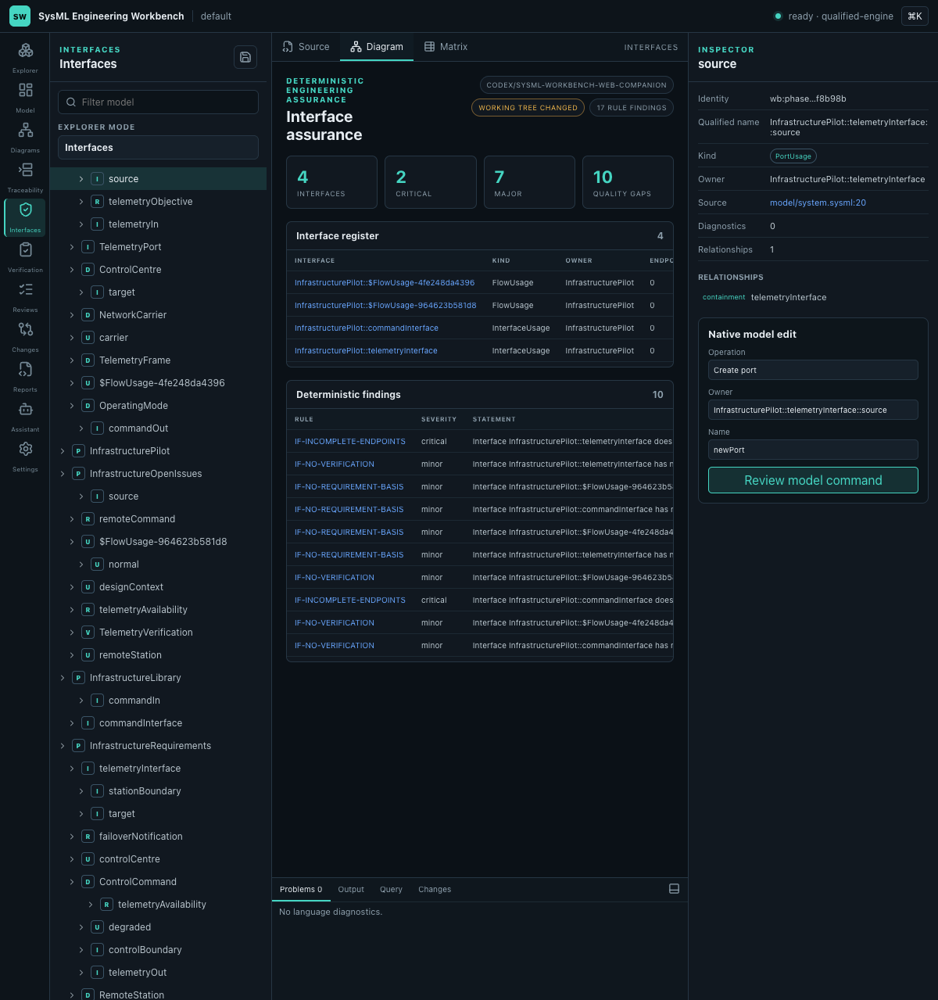

# Web Companion Deployment Decision

Status: implementation candidate; merge and live Pages deployment pending

Date: 2026-07-25

Branch: `codex/sysml-workbench-web-companion`

## Outcome

The recommended delivery path is the modern GitHub Pages workbench paired with
a local companion. This advances the product without an Apple
Developer ID and preserves the local/private engineering authority boundary.

GitHub Pages supplies only versioned UI assets. The local companion owns:

- workspace and filesystem authorization;
- the locked SysML/KerML language engines and libraries;
- semantic snapshots, commands, rules, reviews, Git, and reports;
- credentials, audit, and all source mutation.

The static site alone remains Profile A: a bounded sample/evaluation surface.
The same shell becomes Profile B only after an explicit companion launch and
successful pairing. The legacy viewer is isolated behind `?legacy=1`.

## Implemented user flow

1. User launches the local companion with a
   `sysml-workspace.yaml`.
2. Launcher canonicalizes the file, authorizes only its containing root, and
   starts the qualified service on `127.0.0.1` with an OS-selected port.
3. Launcher opens the exact Pages URL with only the loopback origin and a
   short-lived pairing code in the URL fragment.
4. The modern shell consumes and scrubs the fragment.
5. Browser requests exact-origin Local Network Access permission for the
   explicitly annotated loopback target and completes one-time pairing.
6. Service returns short-lived credentials and an opaque workspace handle.
7. UI negotiates the Workbench Protocol and opens the selected workspace by
   handle. No local path is exposed to the page.
8. Closing the launcher stops the companion.

Source checkout command:

```bash
npm run workbench:companion -- \
  --workspace-file /absolute/path/to/sysml-workspace.yaml
```

Exact-engine release bundle entry points:

```text
bin/start-pages-companion.sh <workspace-file>
bin/start-pages-companion.cmd <workspace-file>
```

## Security decision

The implemented companion uses ephemeral loopback HTTP/WS rather than
installing a locally trusted certificate. It does not bind to a LAN address.
Compensating controls are:

- exact allowed Pages origin and validated Host;
- no wildcard/reflected CORS;
- browser Local Network Access permission with an explicit `loopback` target;
- legacy Private Network Access preflight compatibility;
- one-time short-expiry pairing code;
- atomic consumption: every replay is rejected even before expiry;
- bootstrap secret in the fragment, followed by immediate scrubbing;
- short-lived audience/origin-bound bearer and CSRF credentials;
- opaque workspace handle instead of a browser-provided path;
- canonical path/root/symlink validation in the service;
- strict Pages CSP and no provider/network egress by default.
- top-level-window enforcement: framed contexts render only a security notice
  and never consume or submit pairing material.

Remote or shared deployment is a different profile and still requires TLS,
authentication, authorization, tenant isolation, and its own threat-model
amendment.

## Deterministic acceptance evidence

`npm run verify:web-companion` proves:

- the deployed build selects the modern Pages profile;
- Pages base path and CSP are correct;
- the launcher targets the configured Pages URL;
- neither launch URL nor pairing response exposes the workspace path;
- loopback-only service, Local Network Access target annotation, and legacy
  exact-origin PNA preflight compatibility pass;
- pairing returns an opaque workspace handle;
- pairing replay is rejected;
- framed browsing contexts cannot enter pairing or privileged workflows;
- Workbench Protocol initialization succeeds;
- the selected multi-file pilot workspace opens through the handle.

The qualification record is emitted to:

```text
generated/release-evidence/web-companion-qualification.json
```

Unit/integration coverage additionally rejects disallowed origins and verifies
the handle-to-local-path translation remains service-side.

Headed-browser qualification against the exact locked engines loaded the
four-document pilot, scrubbed the bootstrap fragment, reported
`ready · qualified-engine`, opened Interface assurance, and produced zero
console errors or warnings:



## Delivery impact

Retain:

- shared modern React workbench;
- typed client/service protocol;
- local Workbench Service and qualified engines;
- optional Tauri shell as a future native channel.

Replace:

- legacy viewer as the default Pages entry point;
- desktop-signing dependency as the only plausible public delivery sequence;
- browser-visible workspace paths.

Defer:

- signed/notarized desktop release;
- managed hosted source authority;
- collaborative multi-tenant operation;
- arbitrary local-folder selection initiated by public JavaScript.

## Remaining gates

This change is not live until the stacked PR is reviewed, merged through its
accepted base, and the Pages deployment workflow succeeds on `main`.

Before calling Profile B a supported public release:

- publish and verify the portable companion bundle for each claimed OS;
- complete clean-machine browser Local Network Access tests on those
  OS/browser combinations;
- reconcile/dispose runtime distribution and license blockers;
- complete the three-person usability pilot and manual accessibility review;
- publish checksums, notices, recovery instructions, and a support policy.

Apple Developer ID signing and notarization remain relevant only to the
optional native macOS channel; they do not block this web-companion path.

## Browser Local Network Access

Current Chrome uses a permission prompt for public-site requests to loopback
and local-network targets. The companion client marks the pairing fetch with
`targetAddressSpace: 'loopback'`, applies a 15-second abort timeout, and gives
explicit permission-recovery guidance rather than waiting indefinitely.
Permission is scoped to the exact Pages origin. The service retains its
`Access-Control-Allow-Private-Network` response for compatibility with
browsers that still implement the earlier Private Network Access preflight,
but that preflight is not the primary current Chrome control.

References:

- [Chrome Local Network Access](https://developer.chrome.com/blog/local-network-access)
- [WICG Local Network Access explainer](https://github.com/WICG/local-network-access/blob/main/explainer.md)
