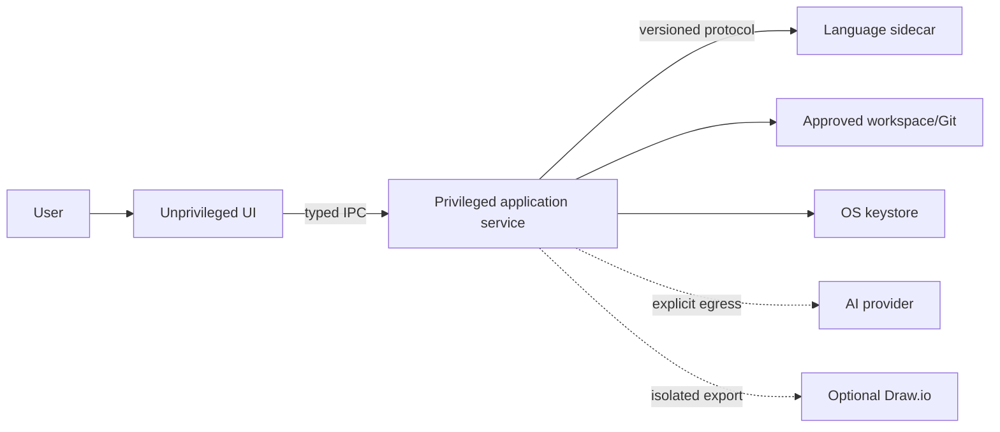

# Threat Model

Status: Phase 0 architecture baseline; each control closes before its capability enters

## Assets

- proprietary model source and libraries;
- Git history/baselines;
- reviews/evidence/reports;
- provider credentials;
- local filesystem integrity;
- command approvals/audit history;
- signed application/engine binaries.

## Trust boundaries

## Threats and controls

| Threat | Control |
|---|---|
| path traversal/symlink escape | canonical paths, approved roots, no follow-outside-root |
| malicious workspace content | bounded parser/renderer resources, no code execution, sanitization |
| IPC privilege escalation | allowlisted commands, schemas, window identity, capability scopes |
| sidecar substitution | signed/checksummed pinned binary and schema handshake |
| compromised/exploitable sidecar | app-mediated documents, no direct workspace write/path API, network denied, private working directory, OS sandbox where available, resource limits, escape tests |
| watcher races/TOCTOU | canonical handles, source hashes, stale-base conflicts |
| command partial write | overlay validation, atomic multi-file journal/rollback |
| report XSS/injection | escaping, CSP, sanitized HTML/SVG, safe PDF pipeline |
| credential/model leakage | keystore, redacted logs, explicit minimized egress |
| remote content/native bridge | local export by default; any owner-approved remote markup view is a separate sandboxed WebView with no IPC and explicit egress consent |
| malicious Git config/hooks | no implicit hook execution; bounded Git arguments/environment |
| denial of service | document/byte/graph/deadline limits and cancellation |
| AI prompt/tool abuse | narrow read/proposal tools, identity validation, explicit approval |
| dependency compromise | lockfiles, SBOM, signature/checksum, audit policy |

## Security acceptance

Threats receive accountable owners, evidence ids, and closure before the first phase that introduces the capability. P1 closes workspace, sidecar, IPC, path, watcher, Git, and dependency controls used by P1. P4 closes diagram/export and report-rendering controls used by P4. P6 closes AI/credential/egress controls. P7 verifies the integrated release and residual-risk acceptance. Remote/shared deployment requires a separate authentication/authorization/tenant threat model.
